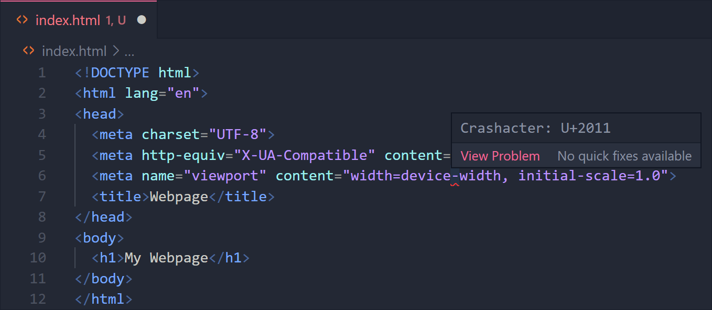

# Crashacters

### Highlights invisible and misleading Unicode characters as errors
 

## Features

Crashacters allows you to quickly spot characters that don't belong in your files. Saves you from wasting time debugging when your application crashes because the file you're using as input has an unexpected character that is either invisible in your editor or looks just like a valid character.

You can customize the ranges of Unicode characters that you want the extension to highlight as errors using the extension settings in VSCode. 

If you believe that a certain character should be included in or excluded from the default character ranges, please [open an issue with the tag "default blacklist"](https://github.com/davidreis97/Crashacters/issues/new). Feel free to also send any feature suggestions/bug reports.

## Development

Just like most LSP-based extensions,

- Run `npm install` in the root folder.
- Open VS Code in the root folder.
- Press Ctrl+Shift+B to compile the client and server.
- Switch to the Debug viewlet.
- Select `Launch Client` from the drop down.
- Run the launch config.
- If you want to debug the server as well use the launch configuration `Attach to Server`
- In the [Extension Development Host] instance of VSCode, open any document.
- Enter blacklisted characters and the extension will highlight them.
